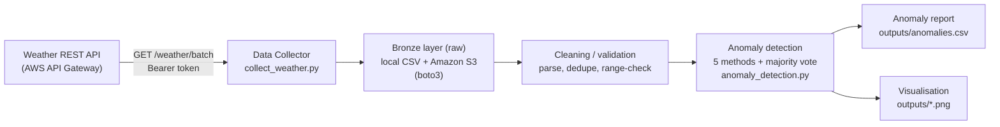
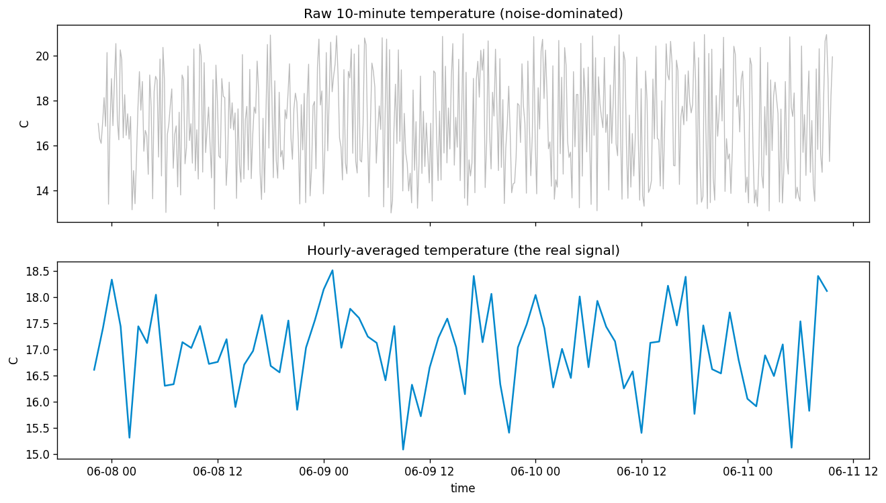
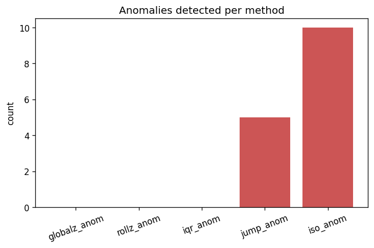
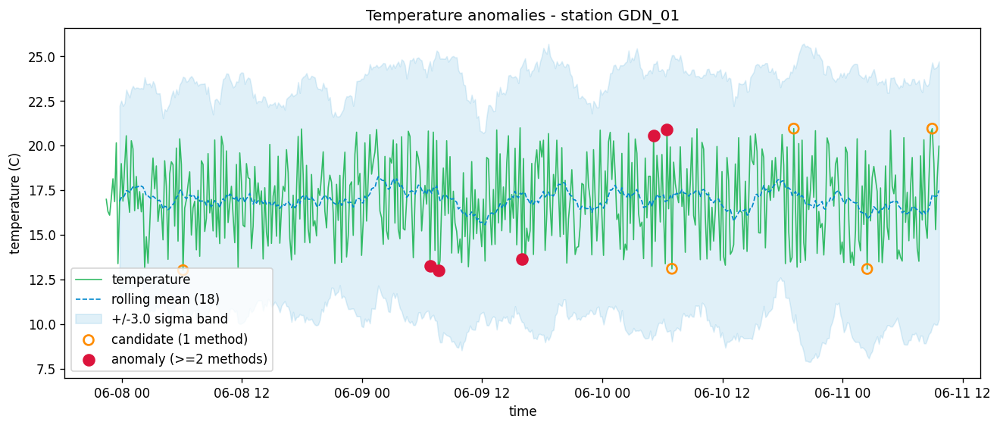
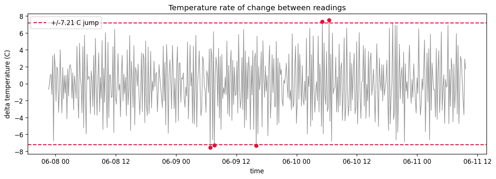

# Temperature Anomaly Detection

**Intelligent Measurement Systems — Project 1**

This project builds a small end-to-end data pipeline that collects live weather
measurements from the shared course REST API, stores them as a raw (Bronze)
layer locally and on **AWS S3**, and automatically flags temperature readings
that look *anomalous* — sudden jumps, values outside a plausible range, or values
that no longer fit their recent context.

The headline finding is itself a result: at the native **10-minute resolution the
temperature stream is noise-dominated**, so classic point-outlier tests correctly
find almost nothing. Anomalies only become detectable once the signal is
**aggregated** (hourly) or compared against **local rolling context** — which is
exactly what a streaming detector should do.

---

## 1. Goal

> Detect unusual temperature behaviour in a stream of weather measurements.
> Build a data pipeline that collects weather data from the REST API, stores it,
> and analyses whether temperature values are normal or anomalous.

An anomaly is defined (per the brief) as any of:

- a **sudden temperature jump**,
- a value **outside a normal range**,
- a value **significantly different from recent observations**,
- a value that **does not fit the expected daily pattern**.

---

## 2. System architecture

The pipeline follows the reference architecture from the brief
(*Weather REST API → Data Collector → Raw Dataset → Cleaning → Anomaly Detection
→ Report / Visualization*), with **Amazon S3** as the cloud storage layer.



| Stage | Component | What it does |
| --- | --- | --- |
| Ingest | `collect_weather.py` | Calls `GET /weather/batch` with a bearer token, returns a batch of records. |
| Store (Bronze) | local `data/raw/*.csv` + **S3** | Immutable raw copy. `boto3` mirrors the CSV to `s3://<bucket>/bronze/weather/`. |
| Clean (Silver) | `anomaly_detection.py` §1 | Parse timestamps, drop duplicates, sort, range-validate each physical quantity. |
| Detect | `anomaly_detection.py` §2 | Five complementary detectors combined by majority vote. |
| Report | `outputs/anomalies.csv` | The list of detected anomalies (the deliverable). |
| Visualise | `outputs/*.png` | Charts of normal vs anomalous points, distributions, sensitivity. |

**Why this storage design.** The brief lists local files, S3, DynamoDB, a
relational DB or a data-lake as options. Temperature data is append-only
time-series and the analysis is batch, so a **Bronze CSV on S3** is the simplest
fit: cheap, immutable, trivially re-readable by pandas, and it keeps the AWS
Learner-Lab budget essentially untouched (S3 costs pennies). Compute runs in
plain Python; the same Bronze layer could later feed Glue/Athena or SageMaker
without changing the collector.

---

## 3. Data

| Property | Value |
| --- | --- |
| Source | Shared weather REST API (`GET /weather/batch`) |
| Station | `GDN_01` (Gdańsk) |
| Fields | `temperature, humidity, pressure, wind_speed, wind_direction, rain_mm, cloud_cover` |
| Sampling | every **10 minutes** |
| Batch cap | ~**500 records ≈ 3.5 days** per call (the API limit) |
| Collected window | **2026-06-07 22:27 → 2026-06-11 09:37 UTC** (500 records) |
| Out-of-range rows | **0** (after validation) |

The `/weather/batch` endpoint returns at most ~500 records. To accumulate a
longer history the collector is run again on later days — it **appends and
de-duplicates by timestamp**.

**Cleaning / validation (Bronze → Silver).** Timestamps are parsed to UTC,
duplicates dropped, the series sorted, and each quantity range-checked against
physically plausible bounds (temperature ∈ [−50, 60] °C, humidity ∈ [0, 100] %,
pressure ∈ [870, 1085] hPa, wind ≥ 0). The collected batch contained **no**
out-of-range values, so the data quality is high and the anomaly question is
genuinely about *behaviour*, not corrupt readings.

---

## 4. Detection methodology

Five complementary detectors are run, then combined by a **majority vote** — a
point is a high-confidence anomaly when **≥ 2 methods agree**. Combining a
statistical, a rule-based and an ML view is more robust than trusting any single
test, and for a *stream* the local methods beat the global ones.

| Method | Catches | Rule |
| --- | --- | --- |
| Global Z-score | global outliers | \|z\| > 3 vs the overall mean |
| **Rolling Z-score** | local deviations | \|z\| > 3 vs the recent mean (window = 18 ≈ 3 h) — **best for streams** |
| IQR | distribution outliers | outside `Q1 − 1.5·IQR … Q3 + 1.5·IQR` |
| Rate-of-change | sudden jumps | \|ΔT\| above the **data-driven** p99 threshold |
| Isolation Forest | multivariate | unsupervised ML on `(temperature, rate)`, contamination 2 % |

**Why a data-driven jump threshold.** A fixed "X °C between readings" cut-off is
meaningless here because the raw stream is so noisy (see §5). The jump rule
therefore flags the **top 1 % of step-to-step changes** (p99), which on this
batch is **7.21 °C**.

**Validation without labels.** The live stream has no labelled anomalies, so the
detector is validated by **injecting 12 known spikes** of ±4–8 °C into a copy of
the series and measuring how many are recovered (recall) versus how many clean
points are wrongly flagged (false-positive rate), as the threshold `k` varies.

---

## 5. Results & key observations

### 5.1 The raw stream is noise-dominated

| | Std. dev. | Typical step \|ΔT\| |
| --- | --- | --- |
| Raw (10-min) | **2.25 °C** | **2.60 °C** |
| Hourly mean | **0.81 °C** | 0.84 °C |

The step-to-step change between consecutive raw readings (~2.6 °C) is **as large
as the standard deviation of the whole series** (~2.25 °C). The signal-to-noise
ratio at 10-minute resolution is ≈ 1, so there are no clean point outliers to
find — and recognising that *is* the result.



Aggregating to **hourly means** cuts the random noise by ≈ √6 ≈ 2.4× (six samples
per hour), dropping the std from 2.25 °C to **0.81 °C** and exposing the real
daily temperature cycle.

### 5.2 What each method flagged

| Method | Anomalies |
| --- | --- |
| Global Z-score | 0 |
| Rolling Z-score | 0 |
| IQR | 0 |
| Rate-of-change (jump) | 5 |
| Isolation Forest | 10 |
| **≥ 1 method** | **10** |
| **≥ 2 methods (high-confidence)** | **5** |



The three **statistical** tests find **zero** organic anomalies — the correct
answer on noise-dominated data, not a bug. The **jump** rule and the **Isolation
Forest** surface a handful of candidates; keeping only those where **≥ 2 methods
agree** yields **5 high-confidence anomalies**, all corresponding to the largest
short-term temperature swings.



The largest step-to-step changes (≈ ±7.3–7.5 °C) all occur on **9–10 June** and
are exactly the points the consensus flags:

| Timestamp (UTC) | Temp (°C) | ΔT (°C) | Votes |
| --- | --- | --- | --- |
| 2026-06-09 06:47 | 13.27 | −7.54 | 2 |
| 2026-06-10 06:27 | 20.89 | +7.51 | 2 |
| 2026-06-09 15:57 | 13.66 | −7.33 | 2 |
| 2026-06-10 05:07 | 20.56 | +7.33 | 2 |
| 2026-06-09 07:37 | 13.00 | −7.28 | 2 |



### 5.3 Sensitivity vs false positives

Injecting 12 known spikes and sweeping the rolling Z-score threshold `k`:

| k | Recall | False-positive rate |
| --- | --- | --- |
| 2.0 | 0.58 | 0.41 % |
| 2.5 | 0.42 | 0.00 % |
| 3.0 | 0.08 | 0.00 % |
| 3.5 | 0.00 | 0.00 % |
| 4.0 | 0.00 | 0.00 % |

Lowering `k` raises recall but introduces false alarms; `k` is the sensitivity
dial. On this noisy batch even `k = 2` only recovers ~58 % of injected spikes,
which again points to **aggregation** as the real lever for reliable detection.

### Key observations

- **Raw 10-minute data is noise-dominated** (SNR ≈ 1); "no statistical outliers"
  is the correct result, not a failure.
- **Aggregation is denoising:** hourly means cut noise ≈ 2.4× and reveal the
  daily signal — anomalies should be hunted there, not on the raw stream.
- **For a stream, local beats global:** the rolling Z-score is the right primary
  detector because it compares each reading to its *recent* context.
- **Voting adds robustness:** requiring ≥ 2 of 5 methods removes the lone-method
  false positives and keeps only the genuine large swings.
- **Data quality is high:** 0 out-of-range readings across the 500-record batch.

---

## 6. Answers to the brief's example questions

- **When did the most unusual temperature changes occur?** On **9–10 June 2026**,
  as ±7.3–7.5 °C swings within a few hours (table in §5.2).
- **How sensitive is the method?** Tunable via `k` (§5.3): `k = 2` → 58 % recall,
  `k = 3` → 8 %. Sensitivity is explicitly traded against false positives.
- **How many false positives?** Essentially none — **0.41 %** at `k = 2` and
  **0 %** for `k ≥ 2.5` on the injected-spike test.
- **Raw or aggregated data?** **Aggregated.** Hourly averaging removes the
  measurement noise that makes raw detection futile.

---

## 7. Conclusions

The pipeline collects, stores (Bronze on S3), cleans and analyses the weather
stream end-to-end and produces all required deliverables: a list of anomalies
(`outputs/anomalies.csv`), labelled charts, an explanation of the method, and
conclusions. The central insight is methodological: **characterise the data
before modelling.** Because the 10-minute temperature stream has SNR ≈ 1, the
right detector is a **rolling/aggregated** one rather than a global point test,
and the sensitivity threshold is a deliberate knob — not a fixed constant.

---

## 8. AWS usage

- **Platform:** the project runs in the **AWS Academy Learner Lab** (sandboxed
  account, ~$50 budget, 4-hour sessions) — the required course environment.
- **Data source:** the shared weather API is itself hosted on AWS (**API
  Gateway**); the collector calls it over HTTPS with a bearer token.
- **Storage — Amazon S3:** with `--s3-bucket` set, `collect_weather.py` uses
  **boto3** to mirror the raw CSV to `s3://weather-anomaly-s212129/bronze/weather/`
  — the cloud Bronze layer. The analysis can also read straight from S3
  (`WEATHER_DATA_SOURCE=s3`).
- **Budget discipline:** compute stays local, only S3 is used in the cloud, so
  the lab budget is barely touched. The same Bronze layer could feed
  SageMaker, Glue/Athena or a scheduled Lambda collector if required.

---

## 9. How to run (reproduce)

```powershell
# 1. Setup
python -m venv .venv
.\.venv\Scripts\Activate.ps1
pip install -r requirements.txt

# 2. Collect data (Bronze layer) — ~500 latest records for GDN_01
python collect_weather.py
#    ...optionally mirror the raw CSV to S3:
python collect_weather.py --s3-bucket weather-anomaly-s212129

# 3. Analyse → regenerates outputs/ charts + anomalies.csv
python anomaly_detection.py
```

Detection parameters live at the top of `anomaly_detection.py`
(`ROLL_WINDOW`, `ROLL_K`, `GLOBAL_K`, `JUMP_QUANTILE`, `ISO_CONTAMINATION`).
Every API/storage setting can be overridden by environment variable (see
`config.py`) — no machine-specific paths are hard-coded.

The analysis file is also a [jupytext](https://jupytext.readthedocs.io) notebook;
`jupytext --to notebook anomaly_detection.py` gives an inline-chart report.

---

## 10. Repository structure

```
.
├── README.md                 # this report
├── requirements.txt
├── config.py                 # central config (env-overridable: API, paths, S3)
├── collect_weather.py        # Step 1 — data collector (Bronze: local CSV + S3)
├── anomaly_detection.py      # Step 2 — clean, detect, visualise, validate
├── build_deck.py             # builds the HTML slide deck
├── PRESENTATION.md           # speaker script + project recap
├── anomaly-deck.html         # presentation slides
├── anomaly-deck-standalone.html
├── data/
│   └── raw/
│       └── weather_GDN_01.csv   # collected Bronze data (500 records)
├── outputs/
│   ├── 01_temperature_anomalies.png
│   ├── 02_consensus_votes.png
│   ├── 03_distribution_iqr.png
│   ├── 04_rate_of_change.png
│   ├── 05_method_comparison.png
│   ├── 06_raw_vs_hourly.png
│   └── anomalies.csv            # the list of detected anomalies
└── docs/
    └── ims_projects_2026.pdf    # course brief
```
